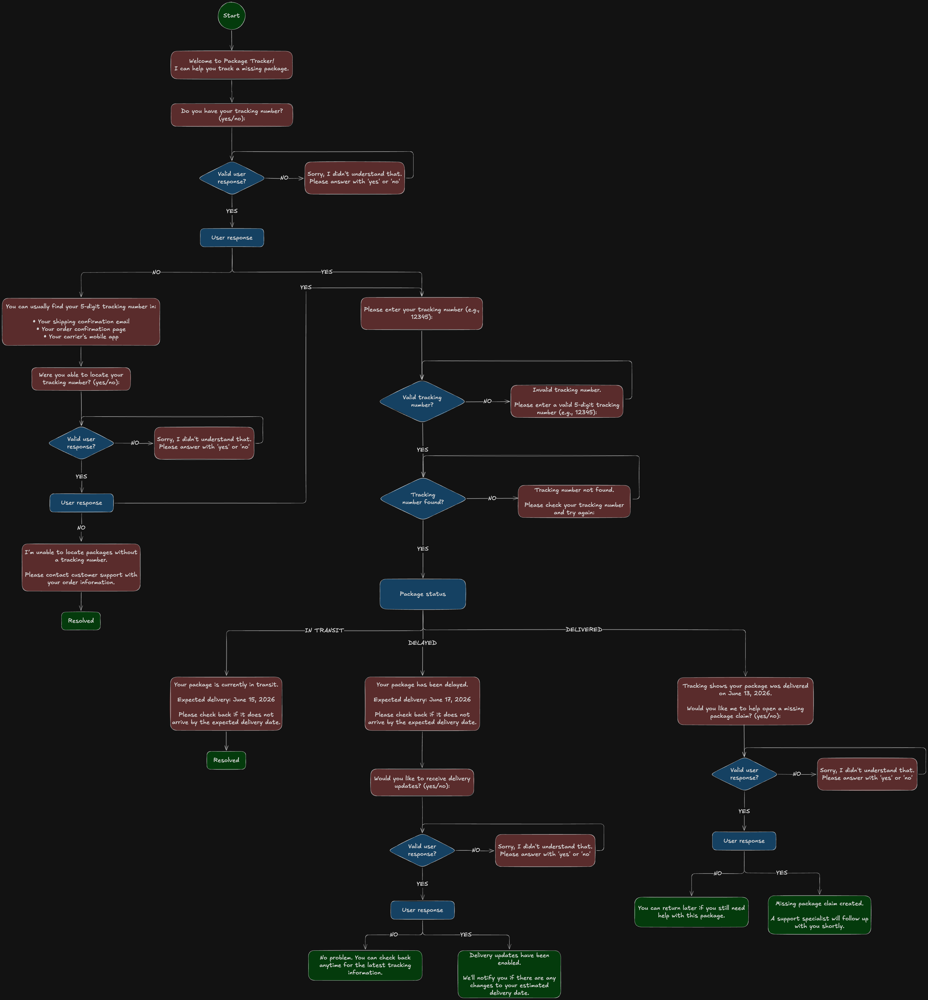

# Package Tracker Chatbot

A command-line customer service chatbot that helps users track lost packages, view shipment status updates, and initiate a missing package claim when necessary.

This project was developed as part of the eGain Software Engineer Take-Home Assignment.

---

## Overview

The chatbot guides users through a package tracking workflow using a decision-tree conversation design. Users can:

- Check the status of a package using a tracking number
- Receive shipment updates for packages that are in transit or delayed
- Get help locating a tracking number
- Initiate a missing package claim for delivered packages
- Recover from invalid or unexpected inputs through error handling

The goal was to create a simple but realistic customer service experience that demonstrates conversation design, problem solving, and clean implementation.

---

## Approach

The chatbot was designed around a structured conversation flow that mirrors a real package tracking support interaction.

### Key Conversation Paths

- User has a tracking number
- User needs help finding a tracking number
- Package is in transit
- Package is delayed
- Package has been delivered
- Missing package claim creation

### Error Handling

The chatbot handles several unexpected input scenarios, including:

- Invalid tracking number format
- Tracking number not found
- Invalid responses to yes/no questions

This ensures the user can recover from mistakes and continue the conversation successfully.

---

## Conversation Flow



---

## Features

- Package tracking by tracking number
- Tracking number assistance
- Shipment status updates
- Missing package claim creation
- Input validation
- Error handling and recovery
- Clean command-line interface

---

## Installation

### Clone the Repository

```bash
git clone <repository-url>
cd package-tracker-chatbot
```

### Run the Chatbot

```bash
python3 chatbot.py
```

No external dependencies are required.

---

## Demo

The following recording demonstrates:

- Finding a tracking number
- Invalid tracking number handling
- Tracking number not found handling
- Delivered package workflow
- Missing package claim creation


---

## Example Conversation

```text
Welcome to Package Tracker!
I can help you track a missing package.

Do you have your tracking number? (yes/no): no

You can usually find your tracking number in:
- Your shipping confirmation email
- Your order confirmation page
- Your carrier's mobile app

Were you able to locate your tracking number? (yes/no): yes
Please enter your tracking number (e.g., 12345): abc

Invalid tracking number.
Please enter a valid 5-digit tracking number (e.g., 12345): 22222

Tracking number not found.
Please check your tracking number and try again: 34567

Tracking Status: Delivered
Tracking shows your package was delivered on June 13, 2026.
I can help start a missing package investigation.

Would you like to open a missing package claim? (yes/no): yes

Missing package claim created.
A support specialist will follow up with you shortly.

Thank you for using Package Tracker. Goodbye!
```

---

## Project Structure

```text
package-tracker-chatbot/
│
├── chatbot.py
├── README.md
│
├── demos/
│   ├── demo.gif
│   └── demo.tape
│
├── docs/
│   └── flowchart.png
│
└── package_tracker/
    ├── conversation_handlers.py
    ├── messages.py
    ├── tracking_data.py
    └── user_input.py
```

---

## Future Improvements

Given more time, I would expand the chatbot with additional customer service capabilities:

- Human-agent escalation for unresolved issues
- Additional package statuses and delivery exceptions
- Real shipping carrier API integration
- Email or SMS delivery notifications
- Order number lookup support
- Claim status tracking after submission

---

## Technologies Used

- Python 3
- Command-Line Interface (CLI)
- Decision Tree Conversation Design

---
